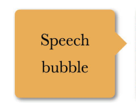

#### 邻边投影

```css
box-shadow: 3px 3px 6px -3px black;
```

双侧投影

```css
box-shadow: 5px 0 5px -5px black,
-5px 0 5px -5px black;
```

#### 不规则投影 



```css
filter: drop-shadow(2px 2px 10px rgba(0,0,0,.5));
```

#### 染色效果

```css
/**
为一幅灰度图片（ 或是被转换为灰度模式的彩色图片） 增加染色效果
（ color tint）， 是一种流行且优雅的方式， 可以给一系列风格迥异的照片带来
视觉上的一致性。 我们通常会在静止状态下应用这个效果， 当发生 :hover
或其他交互时再去除。
**/
filter:sepia(1) saturate(1) hue-rotate(295deg);
```

### 毛玻璃效果

```css
body, main::before {
    background: url("tiger.jpg") 0 / cover fixed;
    z-index: -1;
}
main {
    position: relative;
    background: hsla(0,0%,100%,.3);
    overflow: hidden;
}
main::before {
    content: '';
    position: absolute;
    top: 0; right: 0; bottom: 0; left: 0;
    filter: blur(20px);
    margin: -30px;
}
```

#### 45°折角

```css
background: #58a; /* 回退样式 */
background: linear-gradient(-135deg, transparent 2em, #58a 0) /*切角效果*/
/**
增加一个
暗色的三角形来实现翻折效果。 实现方法是增加另一层渐变来生成这个三
角形并将其定位在右上角， 这样就可以通过 background-size 来控制折角
的大小。
**/
background:
linear-gradient(to left bottom,
transparent 50%, rgba(0,0,0,.4) 0)
no-repeat 100% 0 / 2em 2em;
---------------

```


