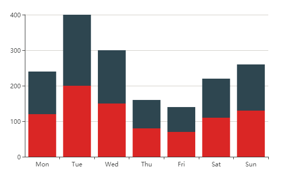

​										重叠柱状图

```javascript
 var option = {
        xAxis: {
            type: 'category',
            data: ['Mon', 'Tue', 'Wed', 'Thu', 'Fri', 'Sat', 'Sun']
        },
        yAxis: {
            type: 'value'
        },
        series: [
            {
                name: 'water',
                stack: 'group', //重点 : stack指定重叠分组
                data: [120, 200, 150, 80, 70, 110, 130],
                type: 'bar'
            },
            {
                name: 'land',
                stack: 'group',//重点 : stack指定重叠分组
                data: [120, 200, 150, 80, 70, 110, 130],
                type: 'bar'
            },
        ]
    };
```

