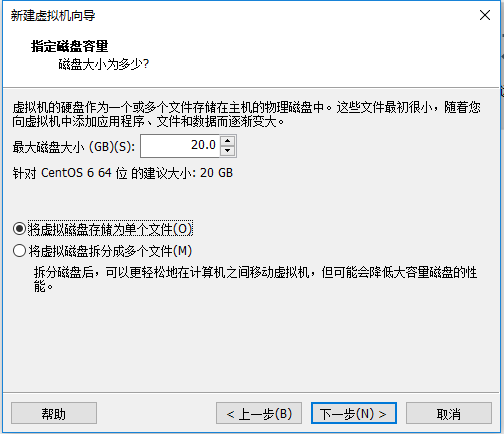

#### 本地 linux 虚拟机安装

##### 下载VMware Workstation 虚拟机管理软件

##### 创建新的虚拟机


##### 使用向导 典型安装


##### 下一步 > 下载Linux虚拟机映像文件

```
阿里巴巴开源镜像站 https://opsx.alibaba.com/mirror
CentOS 6.8获取地址 http://vault.centos.org/
http://mirror.nsc.liu.se/centos-store/6.8/isos/x86_64/CentOS-6.8-x86_64-bin-DVD1.iso

```

##### 点击浏览,选择下载好的iso文件,下一步


##### 设置用户信息,下一步


##### 虚拟机命名,存放地址,按自己喜好


##### 设置磁盘容量 建议20G,是否拆分看个人喜好



##### 完成向导


##### 安装完成


##### 打开终端


##### 输入命令ifconfig 获取本机信息


##### 扩展

```cmd
# 网络连接的三种模式
```

