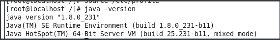

### Linux 下JDK安装

#### JDK下载地址

```cmd
https://www.oracle.com/technetwork/java/javase/downloads/jdk8-downloads-2133151.html
# 资源地址 点击下载的格式然后从控制台Other中查找复制
# Todo:截图
```

#### Linux 下载JDK

```cmd
# tar.gz格式
wget https://download.oracle.com/otn/java/jdk/8u231-b11/5b13a193868b4bf28bcb45c792fce896/jdk-8u231-linux-x64.tar.gz?AuthParam=1571918573_49441ead79a7c1b4be31093ed0e638fd
# rpm格式
wget http://download.oracle.com/otn/java/jdk/8u231-b11/5b13a193868b4bf28bcb45c792fce896/jdk-8u231-linux-x64.rpm?AuthParam=1571918761_1f29df270d21d120205f0a3d7274b29e
# Todo:截图
```

#### 清理系统默认自带JDK

```cmd
# 查看是否又自带的jdk
rpm -qa | grep jdk  # 如果存在=>path
# 卸载
sudo yum remove xxx(path)
# 赋予操作权限 
sudo chmod 777 jdk-8u231-linux-x64.rpm
# 7 用户权限
# 7 用户组权限
# 7 其他人的权限
```

#### 安装

```cmd
# rpm 安装
sudo rpm -ivh jdk-8u231-linux-x64.rpm
# tar.gz 安装
cd developer
tar -zxvf jdk-8u231-linux-x64.tar.gz -C ../usr/java
# 默认安装路径
/usr/java
# 例如 /usr/java/jdk1.8.0_231/
```

#### jdk 配置环境变量

```cmd
# 1)
sudo vim /etc/profile
# 2) 在最下方增加
# 注意等号两边不要有空格
export JAVA_HOME=/usr/java/jdk1.8.xxx
export CLASSPATH=.:$JAVA_HOME/jre/lib/rt.jar:$JAVA_HOME/lib/dt.jar:$JAVA_HOME/lib/tools.jar
export PATH=$JAVA_HOME/bin:$PATH
# JAVA_HOME为安装jdk的路径
# 3) 保存退出, 通过vim的 "esc + :wq" 命令进行保存退出
# 4) 是配置生效
source /etc/profile
```

#### JDK 验证

```cmd
# 执行 
 java -version
# 命令,
```



#### JDK 安装完毕

