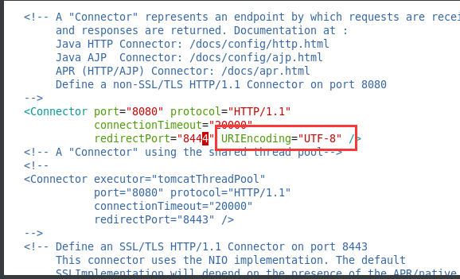
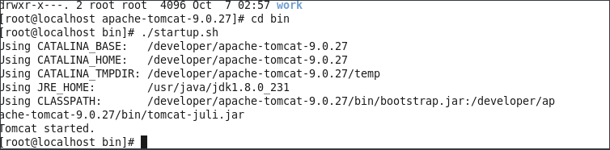
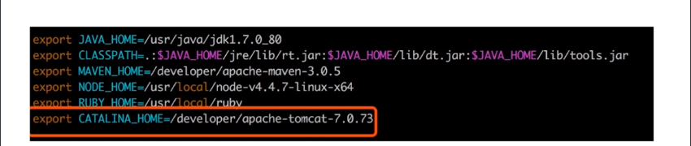

#### Tomcat 简介

```
Tomcat 是一个 WEB 容器， JavaEE程序可以在此运行。
```

#### Tomcat 安装 Linux(下载、安装、配置环境变量、配置UTF-8字符集)

##### 下载

``` cmd
# Tomcat 9
# 下载
cd / => cd /developer/
su root
wget http://mirrors.tuna.tsinghua.edu.cn/apache/tomcat/tomcat-9/v9.0.27/bin/apache-tomcat-9.0.27.tar.gz
```

##### 解压缩

```cmd
tar -zxvf apache-tomcat-9.0.27.tar.gz
# 压缩到当前目录 developer 下即可
```

##### 配置环境变量

```cmd
vim /etc/profile
# 在最下方增加
export CATALINA_HOME=/developer/apache-tomcat-9.0.27
# 注： CATALINA_HOME为您安装tomcat的路径
:wq # 保存退出
source /etc/profile # 使配置生效
```

##### 配置UTF-8字符集

```cmd
cd /developer/apache-tomcat-9.0.27/conf
# 编辑 server.xml
vim server.xml
# 找到配置8080默认端口的位置
# 在 xml 节点末尾增加URIEncoding="UTF-8"
```



#### Tomcat 验证(Linux)

```cmd
#1) 进入系统解压缩后的tomcat目录
#2）进入bin目录
#3）执行 ./startup.sh
cd /developer/apache-tomcat-9.0.27/bin
# 看到下图所示代表启动成功
#4）执行ifconfig 找到此机器的ip地址，进行访问
```



##### 验证问题

```
vm虚拟机启动tomcat，本机访问不到问题
 iptables 未设置 解决方案https://blog.csdn.net/LTsunny/article/details/79417443
 
 service iptables stop --停止
 service iptables start --启动
```


#### Tomcat 常用命令

```cmd
# 启动 tomcat
cd /developer/apache-tomcat-9.0.27/bin
./startup.sh
# 停止 tomcat

# 查看 tomcat 进程

# 开机自启动 tomcat
```



#### tomcat 学习资料

```
http://www.imooc.com/learn/166
```

```
https://blog.csdn.net/u012972294/article/details/86536484
tomcat 配置多个服务
```

