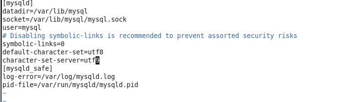

#### MySQL简介

```
# 简介
MySQL 是一个关系型数据库管理系统,由瑞典Mysql AB公司开发,目前属于 Oracle 旗下产品
# 特点
MySQL 所使用的 SQL 语言是用于访问数据库的最常用标准化语言, Mysql 软件采用了双授权政策, 分为社区版和商业版, 由于其体积小,速度快,总体拥有成本低, 尤其是开放源码这一特点,一般中小型网站的开发都选择MySQL作为网站数据库.
```

##### MySQL 安装(Linux环境)

##### 安装

```
MySQL版本 mysql-server-server-5.1.73 #(阿里软件默认带的版本)
1. 执行 yum -y install mysql-server
2. rpm -qa | grep mysql-server 可通过这个检查是否已经安装 mysql-server
3. 默认配置文件在 /etc/my.cnf
```



##### 字符集配置

```
1. vim /etc/my.cnf
2. 添加配置,在[mysqld]节点下添加:
   default-character-set=utf8
   character-set-server=utf8
3. [esc] :wq 保存退出
注: character-set-server/default-character-set:
    服务器字符集,默认情况下所采用的.
补充: 关于中文乱码问题
1.在5.1版本时,为了解决中文乱码问题, my.ini内[mysql]和[mysqld]中都写:
  default-character-set=utf8
2.在5.5版本, [mysql]内可以这么些, [mysqld]内不能再这么写了,而是写
  character-set-server=utf8
```


##### MySQL自启动

```
1. 执行 chkconfig mysqld on
2. 执行 chkconfig --list mysqld 查看(如果2-5位启用on状态即OK)
```


##### 防火墙设置

```
1. sudo vim /etc/sysconfig/iptables
2. 添加配置
   -A INPUT -p tcp -m tcp --dport 3306 -j ACCEPT
   开放 3306 端口
3. :wq 保存退出
4. sudo service iptables restart # 执行命令重启防火墙
```


​															         mysql 启动后的截图

#### MySQL 服务启动

```
1. 启动 mysqld 服务 service mysqld start 或者 /etc/rc.d/init.d/mysqld start
2. Mysql 初始化环境设置
   因为还未设置密码, 执行 mysql -u root 登录 MySQL 服务器
```


#### MySQL 配置

```mysql
# 1. 查看目前mysql的用户
select user,host,password from mysql.user

# 2. 修改 root 密码
set password for root@localhost=password('yourpassword'); 
set password for root@127.0.0.1=password('yourpassword');

# 3. 退出 mysql
exit;

# 4. 重新登录 mysql 输入 
mysql -u root -p

# 5. 输入密码 登录成功

# 6. 删除匿名用户,执行一下sql
#### 查看是否有匿名用户
select user,host from mysql.user;
#### 删除匿名用户
delete from mysql.user where user ='';
#### 再次查看
select user,host from mysql.user;
#### 刷新, 使以上操作生效
flush privileges;

# 7. 插入mysql新用户
insert into mysql.user(Host,User,Password) values ("localhost","yourname",password("yourpassword"));

# 8. 使操作生效
flush privileges;

# 9. 创建新的database
CREATE DATABASE `basename` DEFAULT CHARACTER SET utf8  COLLATE utf8_general_ci;

# 10. 本地用户赋予所有的权限
grant all privileges on basename.* to yourusername@localhost identified by 'yourpassword';
flush privileges;

# 11. 给账号开通外网所有权限
grant all privileges on basename.* to 'yourusername'@'%' identified by 'yourpassword';

grant all privileges on mok_exam.* to 'kevin'@'%' identified by 'Asilence31';
# % 不限制ip开通所有权限
# grant select,insert,update  on basename.* to yourusername@'192.1.1.1' identified by 'yourpassword';
# 给192.1.1.1 IP 下的 你的用户名 开通 增改查 权限
# 代表只开通增改查给指定的账号,并也指定ip地址

# 12. 执行命令使操作生效
flush privileges;

```


#### MySQL 验证

```
1. Linux: 执行ifconfig 查看运行 mysql 服务器的ip地址 # inset addr
2. 通过mysql客户端工具进行连接.比如navicat
```

#### MySQL 的常用命令

```
1. 启动
sudo service mysqld start
2. 关闭
sudo service mysqld stop
3. 重启
sudo service mysqld restart
4. 登录命令
mysql -u ${yourusername} -p <password>

5. 查看mysql 是否启动
service mysqld status 
```


#### 扩展

##### Linnux下重新安装MySql后出现'MySQL Daemon failed to start‘解决方法

```
https://blog.csdn.net/u012286517/article/details/50436740/

# 执行如下命令
rm -fr /var/lib/mysql/*
rm /var/lock/subsys/mysqld 
killall mysqld

service mysqld restart
service mysqld status
```

