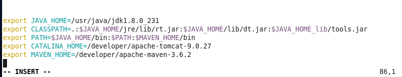
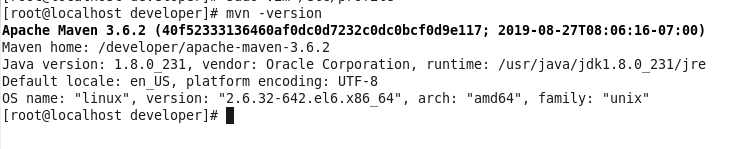

#### Maven 简介

```
Maven是什么? Maven能干什么?
1. 用 Maven 可以方便的创建项目,基于archetyp 可以创建多种类型的java项目
2. Maven 仓库对jar包(artifact)进行统一管理,避免jar 文件的重复拷贝和版本冲突
3. 团队开发,Maven 管理项目的RELEASE和SNAPSHOT版本,方便多模块(Module)项目的各个模块之间的快速集成
```

#### Maven 安装

##### 下载

```cmd
# 官网下载地址 https://maven.apache.org/download.cgi
cd /developer
wget http://mirrors.tuna.tsinghua.edu.cn/apache/maven/maven-3/3.6.2/binaries/apache-maven-3.6.2-bin.tar.gz
tar -zxvf apache-maven-3.6.2-bin.tar.gz
```

##### 配置环境变量

```cmd
sudo vim /etc/profile # 在最下面增加Maven的环境变量
export MAVEN_HOME=/developer/apache-maven-3.6.2
# 注: "="后面是安装在系统中Maven解压缩后的位置
export PATH=$PATH:$JAVA_HOME/bin:$MAVEN_HOME/bin
# 使生效
source /etc/profile

# 配置参考
http://learning.happymmall.com/env/profile
```



##### 验证 Maven

```cmd
mvn -version
```



#### Maven 常用命令

```cmd
# 清除命令
mvn clean
# 编译命令
mvn compile
# 打包命令
mvn package
# 跳过 单元测试
mvn clean package -Dmaven.test.skip=true
```

#### Maven 项目配置

```
settings.xml
```

#### 扩展学习

```
http://www.imooc.com/learn/443
http://learning.happymmall.com/env.html
```

#### iptables

```
# Generated by iptables-save v1.4.7 on Fri Jan 6 16:53:09 2017 #*filter #:INPUT ACCEPT [174:12442] #:FORWARD ACCEPT [0:0] #:OUTPUT ACCEPT [96:10704] #-A INPUT -p tcp -m tcp --dport 3306 -j ACCEPT #-A INPUT -p tcp -m state --state NEW -m tcp --dport 21 -j ACCEPT #-A INPUT -p tcp -m tcp --dport 8080 -j ACCEPT #COMMIT # Completed on Fri Jan 6 16:53:09 2017 #------------------------------------ # Firewall configuration written by system-config-firewall # Manual customization of this file is not recommended. *filter :INPUT ACCEPT [0:0] :FORWARD ACCEPT [0:0] :OUTPUT ACCEPT [0:0] 
-A INPUT -m state --state ESTABLISHED,RELATED -j ACCEPT -A INPUT -p icmp -j ACCEPT -A INPUT -i lo -j ACCEPT #ssh port 
-A INPUT -m state --state NEW -m tcp -p tcp --dport 22 -j ACCEPT #vsftpd 
-A INPUT -p TCP --dport 61001:62000 -j ACCEPT -A OUTPUT -p TCP --sport 61001:62000 -j ACCEPT 
-A INPUT -p TCP --dport 20 -j ACCEPT 
-A OUTPUT -p TCP --sport 20 -j ACCEPT
-A INPUT -p TCP --dport 21 -j ACCEPT 
-A OUTPUT -p TCP --sport 21 -j ACCEPT #mysql port
-A INPUT -p tcp -m tcp --dport 3306 -j ACCEPT #tomcat remote debug port 
-A INPUT -p tcp -m tcp --dport 5005 -j ACCEPT 
-A INPUT -p tcp -m tcp --dport 8080 -j ACCEPT #nginx 
-A INPUT -p tcp -m tcp --dport 80 -j ACCEPT 
-A INPUT -j REJECT --reject-with icmp-host-prohibited 
-A FORWARD -j REJECT --reject-with icmp-host-prohibited COMMIT
```

