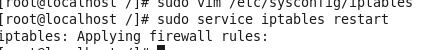
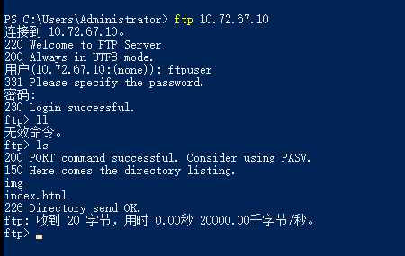

#### vsftpd 简介

```
vsftpd 是"very secure FTP daemon" 的缩写,是一个完全免费的、开放源代码的ftp服务器软件。
非常安全的ftp守护神
特点：vfstpd 是一款在Linux发行版中最受推崇的FTP服务器程序,小巧轻快，安全易用，支持虚拟用户、支持带宽限制等功能。
```

#### vsftpd 安装

##### 安装

```cmd
# 执行
yum -y install vsftpd
# 是否使用sudo权限执行请根据具体环境来决定
# rpm -qa| grep vsftpd 可通过这个检查是否已经安装vsftpd
# 默认配置文件 在/etc/vsftpd/vsftpd.conf
```

##### 创建虚拟用户

```cmd
# 选择在根或用户目录下创建 ftp文件夹：
mkdir ftpfile # 如：/Lftpfile
# 添加匿名用户
useradd ftpuser -d /ftpfile -s /sbin/nologin  # 没有登陆linux的权限
# 修改ftpfile权限
chown -R ftpuser.ftpuser /ftpfile
# 重设ftpuser密码： 
passwd ftpuser L
>123456
```

##### 配置

```cmd
# 进入安装目录
cd /etc/vsftpd
# 编辑
sudo vim chroot_list
# 将刚才新增的虚拟用户添加到此配置文件中，后续要引用
ftpuser
#:wq保存退出

# 配置文件
sudo vim /etc/selinux/config
# 修改 
SELINUX=disabled
# 保存退出
sudo setenforce 0
注：如果一会验证的时候碰到550拒绝访问请执行
sudo setsebool -P ftp_home_dir 1
# 配置完后重启linux服务器，执行reboot命令

# 配置vsftpd.conf
sudo vim /etc/vsftpd/vsftpd.conf
# 详细说明 http://learning.happymmall.com/env.html
# 本项目用到的配置说明 http://learning.happymmall.com/vsftpdconfig/vsftpd.conf.readme.html
# 更多学习配置 http://download.happymmall.com/vsftpdconfig.doc

# 开发时可以使用
chroot_local_user=YES #(用于指定用户列表文件中的用户是否允许切换到上级目录)
# 正式环境下关闭


```

##### 防火墙设置

````cmd
# 打开防火请配置文件
sudo vim /etc/sysconfig/iptables
-A INPUT -p TCP --dport 61001:62000 -j ACCEPT
-A OUTPUT -p TCP --sport 61001:62000 -j ACCEPT
-A INPUT -p TCP --dport 20 -j ACCEPT
-A OUTPUT -p TCP --sport 20 -j ACCEPT
-A INPUT -p TCP --dport 21 -j ACCEPT
-A OUTPUT -p TCP --sport 21 -j ACCEPT
#:wq 保存退出
# 重启防火墙命令
sudo service iptables restart
````



#### vsftpd 验证

```cmd
# 执行 vsftp 重启命令
sudo service vsftpd restart
# 第一次启动时 Shutting down vsftpd 是 failed 不用理会
# 因为这是重启命令， 保证Starting vsftpd 是OK即代表vsftpd服务成功
# 访问
ftp://10.72.67.10
ftpuser 123456

# 方法2 ftp 10.72.67.10
```



#### vsftpd 常用命令

```cmd
# 启动 
sudo service vsftpd start
# 关闭 
sudo service vsftpd stop
# 重启
sudo service vsftpd restart
```

#### 扩展

```cmd
# 配置文件  
# 详细说明 http://learning.happymmall.com/env.html
# 本项目用到的配置说明 http://learning.happymmall.com/vsftpdconfig/vsftpd.conf.readme.html
# 更多学习配置 http://download.happymmall.com/vsftpdconfig.doc

# 常用客户端软件
cuteftp
filezilla
viperftp
flashftp
leapftp
```

```text
本项目要用到的配置项：
1）local_root=/ftpfile(当本地用户登入时，将被更换到定义的目录下，默认值为各用户的家目录)fu
2）anon_root=/ftpfile(使用匿名登入时，所登入的目录)
3）use_localtime=YES(默认是GMT时间，改成使用本机系统时间)
4）anonymous_enable=NO(不允许匿名用户登录)  √
5）local_enable=YES(允许本地用户登录)  √
6）write_enable=YES(本地用户可以在自己家目录中进行读写操作) √
7）local_umask=022(本地用户新增档案时的umask值) √
8）dirmessage_enable=YES(如果启动这个选项，那么使用者第一次进入一个目录时，会检查该目录下是否有.message这个档案，如果有，则会出现此档案的内容，通常这个档案会放置欢迎话语，或是对该目录的说明。默认值为开启) √
9）xferlog_enable=YES(是否启用上传/下载日志记录。如果启用，则上传与下载的信息将被完整纪录在xferlog_file 所定义的档案中。预设为开启。) √
10）connect_from_port_20=YES(指定FTP使用20端口进行数据传输，默认值为YES) √
11）xferlog_std_format=YES(如果启用，则日志文件将会写成xferlog的标准格式) √
12）ftpd_banner=Welcome to mmall FTP Server(这里用来定义欢迎话语的字符串)
13）chroot_local_user=NO(用于指定用户列表文件中的用户是否允许切换到上级目录)
14）chroot_list_enable=YES(设置是否启用chroot_list_file配置项指定的用户列表文件)
15）chroot_list_file=/etc/vsftpd/chroot_list(用于指定用户列表文件)
16）listen=YES(设置vsftpd服务器是否以standalone模式运行，以standalone模式运行是一种较好的方式，此时listen必须设置为YES，此为默认值。建议不要更改，有很多与服务器运行相关的配置命令，需要在此模式下才有效，若设置为NO，则vsftpd不是以独立的服务运行，要受到xinetd服务的管控，功能上会受到限制) √
17）pam_service_name=vsftpd(虚拟用户使用PAM认证方式，这里是设置PAM使用的名称，默认即可，与/etc/pam.d/vsftpd对应) userlist_enable=YES(是否启用vsftpd.user_list文件，黑名单,白名单都可以
18)pasv_min_port=61001(被动模式使用端口范围最小值)
19)pasv_max_port=62000(被动模式使用端口范围最大值)
20)pasv_enable=YES(pasv_enable=YES/NO（YES）
若设置为YES，则使用PASV工作模式；若设置为NO，则使用PORT模式。默认值为YES，即使用PASV工作模式。
   FTP协议有两种工作方式：PORT方式和PASV方式，中文意思为主动式和被动式。
   一、PORT（主动）方式的连接过程是：客户端向服务器的FTP端口（默认是21）发送连接请求，服务器接受连接，建立一条命令链路。
  当需要传送数据时，客户端在命令链路上用 PORT命令告诉服务器：“我打开了****端口，你过来连接我”。于是服务器从20端口向客户端的****端口发送连接请求，建立一条数据链路来传送数据。
   二、PASV（被动）方式的连接过程是：客户端向服务器的FTP端口（默认是21）发送连接请求，服务器接受连接，建立一条命令链路。
  当需要传送数据时，服务器在命令链路上用 PASV命令告诉客户端：“我打开了****端口，你过来连接我”。于是客户端向服务器的****端口发送连接请求，建立一条数据链路来传送数据。
  从上面可以看出，两种方式的命令链路连接方法是一样的，而数据链路的建立方法就完全不同。而FTP的复杂性就在于此。
)
```

