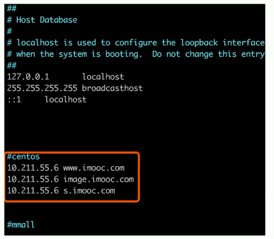

#### Nginx 简介

```md
# Nginx是什么？能干什么？有什么特点？
Nginx 是一款轻量级的Web服务器、也是一款反向代理服务器
俄罗斯的软件
能干什么？
1. 可以直接支持Rails和PHP的程序
2. 可作为HTTP反向代理服务器
3. 作为负载均衡的服务器
4. 作为邮件代理服务器
5. 帮助实现前端动静分离
特点：
高稳定 高性能 资源占用少 功能丰富 模块化结构 支持热部署
```

##### Nginx 安装

##### 安装步骤

```cmd
# 1. 安装依赖 ggc 
yum install ggc # 备注： 可以输入ggc -v 查询版本信息，看系统是否自带安装
# 2. 安装 pcre 
yum install pcre-devel
# 3. 安装 zlib
yum isntall zlib zlib-devel
# 4. 安装openssl 
yum install openssl openssl-devel # 备注： 如需支持ssl，才需安装openssl
# 综合
yum -y install gcc zlib zlib0devel pcre-devel openssl sopenssl-devel

# 5 下载源码包
wget http://nginx.org/download/nginx-1.16.1.tar.gz #下载源码包，选择稳定版本
tar -zxvf nginx-1.16.1.tar.gz # 解压安装

# 6 Nginx 安装
  # 1.进入nginx目录后执行 ./configure
  # 1.1 也可以指定安装目录，增加参数--prefix=/usr/nginx # ./configure--prefix=/usr/nginx
  # 1.2 如果不指定路径, 可以通过 whereis nginx 查询nginx安装目录
  # 1.3 默认安装在/usr/local/nginx
  # 2.继续执行 make 命令
  # 3.继续执行 make install 命令
  # 安装完成
```

##### 增加防火墙访问权限

```cmd
sudo vim /etc/sysconfig/iptables
-A INPUT -p tcp -m state --state NEW -m tcp --dport 80 -j ACCEPT
```

#### Nginx 常用命令

```cmd
# 测试配置文件是否正确  安装路径下的
  /nginx/sbin/nginx -t
# 启动命令
  /nginx/sbin/nginx
# 停止命令
  /nginx/sbin/nginx -s stop # 或者
  nginx -s quit
# 重启命令
  /nginx/sbin/nginx -s reload
# 查看进程命令  pid nginx的进程号
  ps -ef |grep nginx
# 平滑重启
  kill -HUP [Nginx 主进程号(即查看进程命令查到的PID)]
```

#### Nginx虚拟域名配置及测试验证

```markdown
#### 配置步骤
1. 编辑 sudo vim/usr/nginx/conf/nginx.conf
   1. 增加include vhost/*.conf;  (注意 不要忘记 分号 来结束)
   2. 保存退出
2. 在/usr/nginx/conf 目录新建vhost文件夹
   即 /usr/nginx/conf/vhost
3. 创建域名转发配置文件，详情查看【域名配置】
	mokdev.com.conf
	img.mokdev.com.conf
	s.mokdev.com.conf
	learning.mokdev.com.conf
#### 启动(重启)验证
1. 启动： ${nginx}/sbin/nginx
2. 重启： ${nginx}/sbin/nginx -s reload
	注：${nginx}代表安装在系统中的路径，例如/usr/nginx
#### 访问验证
1. 使用默认80端口访问验证: http://localhost:80 或 http://127.0.0.1:80 (此处突显80端口)
```

#### 域名配置

##### 指向端口 

```markdown
* learning.mokdev.com
# 指向目录
​```conf 
    server {
        charset utf-8;
        listen 80;
        autoindex on; # 是否创建索引目录
        # 域名=>会去找location /
        server_name learning.mokdev.com; 
        access_log /usr/nginx/logs/access.log combined;
        index index.html index.htm index.jsp index.php;
        #error_page 404 /404.html;
        if ( $query_string ~* ".*[\;'\<\>].*" ){
          return 404;
        }
        location / {
          proxy_pass http://127.0.0.1:8080;# 转移到这个地址下
          add_header Access-Control-Allow-Origin *;
        }
	}
​```
* mokdev.com(既指向端口又指向目录) 
```

##### 指向目录

```markdown
* img.mokdev.com
​```conf 
    # 指向目录
    server {
        default_type 'text/html';
        charset utf-8;
        listen 80;
        autoindex on; # 是否创建索引目录
        server_name img.mokdev.com; # 域名=》会去找location /
        access_log /usr/nginx/logs/access.log combined;
        index index.html index.htm index.jsp index.php;
        #error_page 404 /404.html;
        if ( $query_string ~* ".*[\;'\<\>].*" ){
          return 404;
        }
        location ~ /(mmall_fe|mmall_admin_fe)/dist/view/* {
          deny all;
        }
        location / {
          root /ftpfile/img/;
          add_header Access-Control-Allow-Origin *;
        }
	}
​```
```


#### Nginx 本地玩耍注意事项

```markdown
可以配置域名转发，但是请一定要配置 host
并且使host生效之后才可以， 设置完成后要重启浏览器
* Linux host 修改
1. sudo vim /etc/hosts
2. 添加好对应的域名及ip
* Windows host 修改
1. Windows/System32/drivers/etc => hosts
2. 打开 并添加对应的域名
```



#### 扩展

```cmd

```

##### Nginx 配置GZIP压缩

```

```

##### Nginx 配置 二级 目录

```

```

