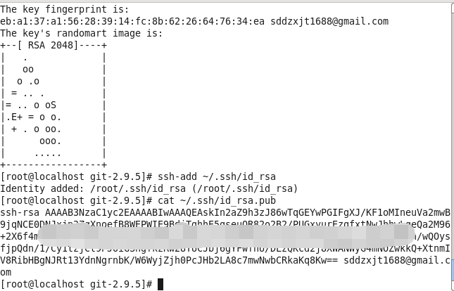

#### Git 简介

```
Git是一款免费的开源的分布式版本控制系统
特点: 是一个开源分布式版本控制系统, 可以有效告诉的处理从很小到非常大的项目版本管理.
```

#### Git 安装

```bash
# 下载
wget https://mirrors.edge.kernel.org/pub/software/scm/git/git-2.9.5.tar.gz

# 安装依赖
sudo yum -y install zlib-devel openssl-devel cpio expat-devel gettexte-devel curl-devel perl-ExtUtils-CBuilder perl-ExtUtils-MakeMaker

# 解压
tar -zxvf git-2.9.5.tar.gz
# 进入 git-2.9.5
cd /git-2.9.5
# 编译
sudo make prefix=/usr/local all
# [安装过程可能会出现问题,可参考如下地址]
#https://www.cnblogs.com/grimm/p/5368777.html
sudo make prefix=/usr/local install

git --version
# >git version 2.9.5
# 安装成功
```

#### Git 配置

```bash
# 基础配置
# 1. 配置用户名(提交时会引用)
git config --global user.name "kevin" 
#把kevin替换成自己的用户名, global全局配置

# 2. 配置邮箱(提交时会引用)
git config --global user.email "sddzxjt1688@gmail.com"

# 3. 其他配置
git config --global merge.tool "kdiff3"
# 要是美妆KDiff3就不用设这一行
git config --global core.autocrlf false
# 让git不要管window/unix换行符转换的事

# 编码配置
git config --global gui.encoding utf-8
# 避免git gui中的中文乱码
git config --global core.quotepath off
# 避免git status 显示的中文文件名乱码
#Windows上还需要配置:
git config --global core.ignorecase false
# git bash

# git ssh key pair 配置
# 1.在Linux的命令行下,或Windows上Git Bash命令行窗口中键入:
ssh-keygen -t rsa -C "sddzxjt1688@gmail.com"
# 2.然后一路回车,不要输入很合密码之类,生成ssh key pair
# 3. 添加公钥
ssh-add ~/.ssh/id_rsa 
# 4. 查看公钥
cat ~/.ssh/id_rsa.pub
# 5. 复制公钥
# 6. 进入github
# 7. 进入个人SSH公钥配置,把公钥复制添加进去,确认提交
# 8. 配置完成
# 注:执行 ssh-add 时出现Could not open a connection to your authentication agent异常. 执行 ssh-add ~/.ssh/rsa 报标题上的错误 先执行 eval`ssh-agent` 再执行 ssh-add ~/.ssh/rsa 成功 然后 ssh-add -l查看 就有新加的rsa了
```



#### Git 验证

```
Linux:
执行 git --version 命令, 出现版本信息, 安装成功
```


#### Git 常用命令

```bash
1. 切换分支
git checkout 分支名
2. 拉取
git pull
3. 提交
git push
```

##### 扩展

```
git基础详细学习,<<版本管理工具介绍----Git篇>>
http://www.imooc.com/learn/208
```

