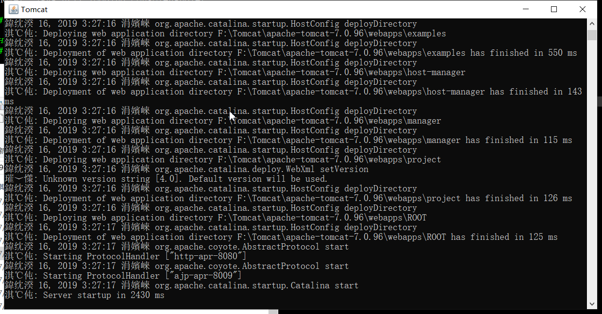

#### 解决方案

```
找到tomcat目录 conf目录中的 logging.properties
将该文件中的UTF-8都改成GBK
问题解决
```

```
参考文章
```

**新从官网下载的Tomcat7和Tomcat8，在运行的时候都会有乱码的问题，就此发现问题，我们就给它就地正法！**



 

经过初步的分析，问题产生的大概原因是由于Tomcat的log日志模块不识别中文的问题，

我们在Tomcat的目录bin/catalina.bat文件中可以发现

[](javascript:void(0);)

```
##Tomcat 7代码大概在195行if not "%LOGGING_CONFIG%" == "" goto noJuliConfig
set LOGGING_CONFIG=-Dnop
if not exist "%CATALINA_BASE%\conf\logging.properties" goto noJuliConfig
set LOGGING_CONFIG=-Djava.util.logging.config.file="%CATALINA_BASE%\conf\logging.properties"
:noJuliConfig
```

[](javascript:void(0);)

 

**产生原因：**
如果没有设置环境变量“%LOGGING_CONFIG%”值，则到Tomcat根目录下“conf”子目录下的“[logging.properties](https://link.zhihu.com/?target=http%3A//logging.properties/)”文件中查看日志记录的配置，找到该文件，可发现很多的“encoding = UTF-8”配置项，因此判断是该配置项影响了Tomcat控制台的中文乱码输出

**解决方案：**

在Tomcat根目录下“conf”子目录下的“[logging.properties](https://link.zhihu.com/?target=http%3A//logging.properties/)”文件中所有的“encoding = UTF-8”都修改为“encoding = GBK”，使其支持中文，然后保存重启Tomcat服务器即可解决

 

logging.properties修改前


logging.properties修改后


 

 重启Tomcat 运行


 

 完美解决！